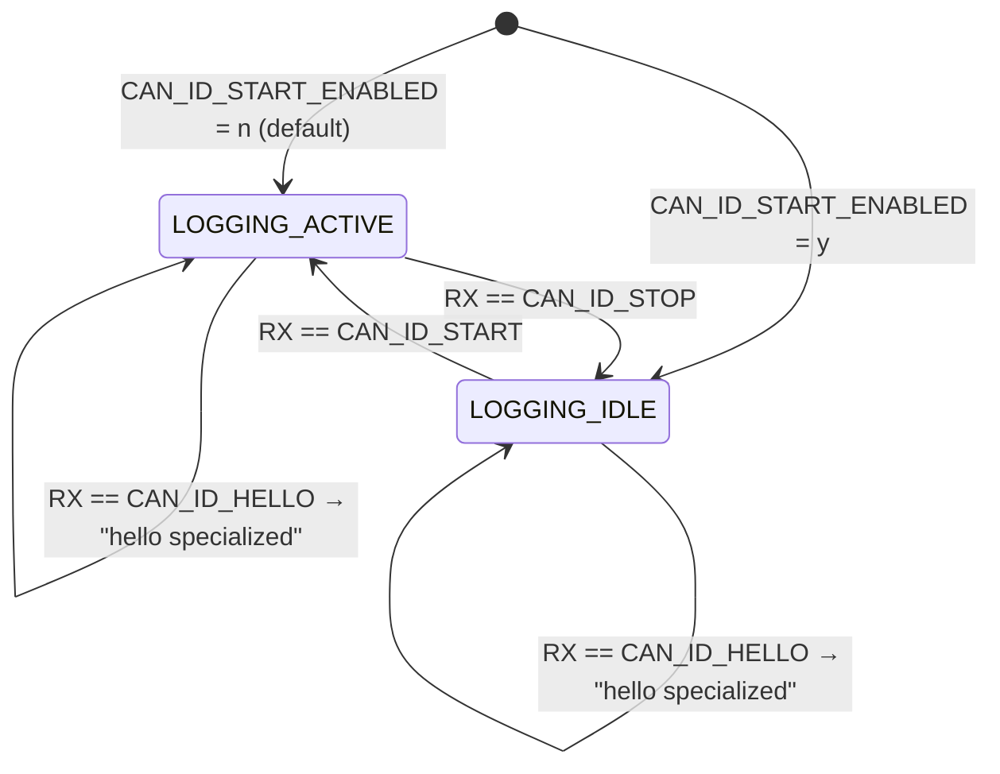

# zephyr-can-monitor

Zephyr RTOS firmware that logs CAN bus traffic over UART/CDC — fully
build-time configurable IDs, bitrate, TX periods and optional start/stop
control.  Includes unit tests runnable on the host without any hardware.

---

## Features

- Receives CAN frames and prints them to UART with **timestamp, ID, DLC and data**
- **Three TX messages** sent at configurable intervals with randomly generated payloads
- **Optional start/stop** control via configurable RX message IDs
- **Optional "hello specialized"** trigger via a configurable RX message ID
- All parameters (bitrate, IDs, periods) set **at build time via Kconfig** — no
  runtime configuration needed
- Unit tests for state machine and output formatter, runnable on `native_sim`

---

## Project Structure

```
zephyr-can-monitor/
├── west.yml               # West manifest — declares Zephyr v3.7 as dependency
├── CMakeLists.txt         # Build entry point for `west build`
├── Kconfig                # Root Kconfig (sources Kconfig.appsymbols)
├── Kconfig.appsymbols     # Custom CONFIG_ options (periods, IDs, bitrate)
├── prj.conf               # Default values for Kconfig options
├── app.overlay            # Placeholder — board overlays provide real config
├── boards/
│   ├── mimxrt1060_evk.overlay  # FlexCAN1 pin-mux (NXP RT1060, Rev C QSPI)
│   ├── native_sim.overlay      # can_loopback0 for host simulation
│   └── native_sim.conf         # Loopback mode + immediate logging for sim
├── src/
│   ├── main.c             # Entry point: device init → can_monitor + can_tx
│   ├── can_monitor.c/h    # RX state machine (IDLE↔ACTIVE), ISR→msgq→thread
│   ├── can_tx.c/h         # Three periodic TX threads with random payloads
│   └── logger.c/h         # UART formatter: timestamp · ID · DLC · data bytes
├── tests/
│   └── unit/
│       ├── can_monitor/         # State machine tests (no optional IDs)
│       ├── can_monitor_start_stop/  # State machine tests (all IDs enabled)
│       └── logger/              # Output format tests (no hardware needed)
└── doc/
    ├── state_machine.mmd  # Logging state machine (Mermaid)
    └── sequence.mmd       # CAN ISR → thread → UART sequence (Mermaid)
```

---

## Architecture

### Component overview

```
┌─────────────────────────────────────────────────────────────────┐
│  main.c          can_monitor          can_tx         logger     │
│    │                  │                  │              │        │
│    ├─init()──────────►│              ┌───┤              │        │
│    └─init()────────────────────────►│   │              │        │
│                       │             │tx1│ k_sleep(T1)  │        │
│  CAN Driver           │             │tx2│ k_sleep(T2)  │        │
│    │ ISR callback      │             │tx3│ k_sleep(T3)  │        │
│    └──k_msgq_put()───►│rx_msgq       └───┘              │        │
│                       │ monitor_thread                   │        │
│                       └──dispatch()──────────────────►  │        │
│                                             logger_print_frame()│
│                                                  printk() → UART│
└─────────────────────────────────────────────────────────────────┘
```

### Logging state machine



> HELLO trigger works in both states.  
> All transitions guarded by the respective `CAN_ID_*_ENABLED` Kconfig.

---

## Requirements

- [Zephyr RTOS](https://docs.zephyrproject.org) v3.7 (declared in `west.yml`)
- `west` build tool
- Board with CAN peripheral — **NXP MIMXRT1060-EVK** recommended  
  (also works with FRDM-K64F; add external CAN transceiver for that board)
- External CAN transceiver (e.g. TJA1051) wired to the MCU's CAN pins

---

## Quick start

### 1 — Set up the west workspace

```bash
# Inside the repo root:
west init -l .
west update          # downloads deps/zephyr and NXP HAL
```

### 2 — Build for NXP MIMXRT1060-EVK

```bash
# Rev C board with QSPI flash (most common variant)
west build -b mimxrt1060_evk@C/mimxrt1062/qspi apps/zephyr-can-monitor
west flash
```

Other variants: `mimxrt1060_evk@B/mimxrt1062/qspi`, `mimxrt1060_evk/mimxrt1062/hyperflash`.

Connect a serial terminal to the on-board USB-UART (115 200 baud):

```bash
picocom /dev/ttyACM0 -b 115200
```

### 3 — Build with optional IDs enabled

```bash
west build -b mimxrt1060_evk@C/mimxrt1062/qspi apps/zephyr-can-monitor -- \
  -DCONFIG_CAN_ID_START_ENABLED=y -DCONFIG_CAN_ID_START=0x200 \
  -DCONFIG_CAN_ID_STOP_ENABLED=y  -DCONFIG_CAN_ID_STOP=0x201  \
  -DCONFIG_CAN_ID_HELLO_ENABLED=y -DCONFIG_CAN_ID_HELLO=0x202
```

### 4 — Run on native_sim (no hardware needed)

```bash
west build -b native_sim apps/zephyr-can-monitor -d build/native_sim --pristine
timeout 5 ./build/native_sim/zephyr/zephyr.exe 2>&1 | tee app.log
```

---

## Kconfig reference

| Option                   | Description                              | Default     |
|--------------------------|------------------------------------------|-------------|
| `CAN_LOGGER_BITRATE`     | CAN bus bitrate (bps)                    | `500000`    |
| `CAN_TX1_PERIOD_MS`      | TX message 1 interval (ms)               | `100`       |
| `CAN_TX2_PERIOD_MS`      | TX message 2 interval (ms)               | `500`       |
| `CAN_TX3_PERIOD_MS`      | TX message 3 interval (ms)               | `1000`      |
| `CAN_TX1_ID`             | TX message 1 CAN ID                      | `0x101`     |
| `CAN_TX2_ID`             | TX message 2 CAN ID                      | `0x102`     |
| `CAN_TX3_ID`             | TX message 3 CAN ID                      | `0x103`     |
| `CAN_ID_START_ENABLED`   | Enable start-logging trigger             | `n`         |
| `CAN_ID_START`           | RX ID to start logging                   | `0x200`     |
| `CAN_ID_STOP_ENABLED`    | Enable stop-logging trigger              | `n`         |
| `CAN_ID_STOP`            | RX ID to stop logging                    | `0x201`     |
| `CAN_ID_HELLO_ENABLED`   | Enable "hello specialized" trigger       | `n`         |
| `CAN_ID_HELLO`           | RX ID to print "hello specialized"       | `0x202`     |

---

## Output format

```
[1234567] ID:0x1A2 DLC:8 Data:DE AD BE EF 00 11 22 33
```

Fields: `[uptime_ms] ID:0x<id> DLC:<n> Data:<hex bytes separated by spaces>`

---

## Unit tests

Tests run on `native_sim` — **no hardware required**.

```bash
west twister -T apps/zephyr-can-monitor/tests -p native_sim --inline-logs
```

| Suite                      | What is tested                                     |
|----------------------------|----------------------------------------------------|
| `can_monitor.default`      | Initial state ACTIVE, frame counting, reset        |
| `can_monitor.start_stop`   | IDLE↔ACTIVE transitions, hello trigger, full cycle |
| `logger.format`            | Timestamp, ID, DLC, data bytes, buffer safety      |

Run a single suite:

```bash
west twister -T apps/zephyr-can-monitor/tests/unit/logger -p native_sim --inline-logs
```

Build-only check (no execution):

```bash
west twister -T apps/zephyr-can-monitor/tests -p native_sim --build-only
```

---

## Diagrams

Mermaid source files are in [doc/](doc/).  
Render with the [Mermaid VS Code extension](https://marketplace.visualstudio.com/items?itemName=bierner.markdown-mermaid)
or the CLI:

```bash
mmdc -i doc/state_machine.mmd -o doc/state_machine.svg
mmdc -i doc/sequence.mmd      -o doc/sequence.svg
```

---

## License

MIT
